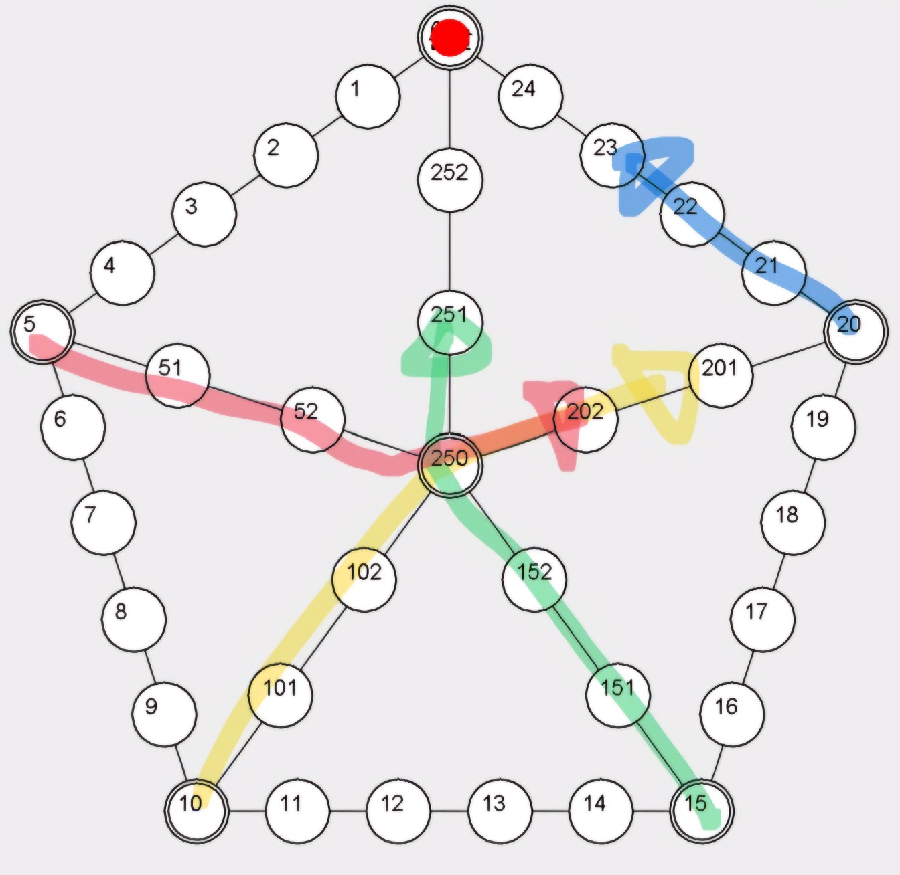
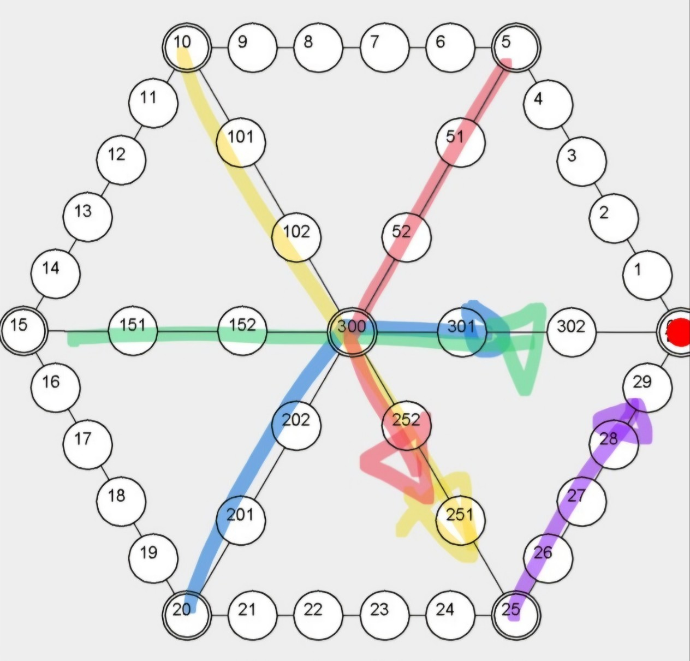

# Software Engineering - Spring 2025
## 윷놀이 Project

This repository contains the **윷놀이 Game Project** for the Software Engineering course (Spring 2025). The project applies **Object-Oriented Analysis and Design (OOAD)** principles to develop a digital version of the traditional Korean board game *윷놀이*.

## 📌 Project Overview
- Develop a **윷놀이 game** using OOAD techniques.
- Players can specify the **number of participants** (2 to 4) and **number of game pieces** (2 to 5).
- The game board supports **custom board shapes**:
  - Rectangle (사각형)
  - Pentagon (오각형)
  - Hexagon (육각형)
- Each board layout includes its own **movement rules**, including:
  - **Branching path selection at the center node**, based on whether the player stops at the center or not.
- Players take turns using:
  - **"Random Throw" button** for random results
  - **"Manual Throw" button** to select specific results for testing
- The game supports:
  - **Piece grouping (말 업기)**
  - **Capturing opponents’ pieces**
  - **Winning condition**: The first player to move all pieces to the goal wins
- Players can **restart** or **exit** after a game finishes

## JavaFX & How to Execute
- This branch contains the project implemented in **JavaFX**.
- For details on JavaFX installation and environment setup, please refer to the **JavaFX 관련 환경설정.txt** file.

- **Clone the repository** (e.g. using GitHub Desktop or the git command line) to your local machine.
- Navigate to **Yutnori_JavaFX > Yutnori_JavaFX.exe** and run it to launch the JavaFX GUI.

### 🧭 Pentagon and Hexagon Movement Examples
Example of path selection in Hexagon and Pentagon board is as following:

#### ▶ Pentagon Board Path Example


#### ▶ Hexagon Board Path Example



## ⚙️ Special Movement Rules
- **중앙 진입 시 멈춤**: 말이 중심 노드에 정확히 도착해 멈출 경우, 결승점까지의 거리가 가장 짧은 경로를 자동으로 선택합니다.
- **중앙 통과 시 회전 방향 선택**: 중심 노드를 지나칠 경우, 꺾이는 각도가 가장 작고 결승점까지의 거리가 짧은 경로를 우선적으로 선택합니다.

## 📅 Project Timeline
### ✅ First Due (5th April)
- Create a **GitHub project page** and post it on the e-class project board.

### ✅ Mid Due (10th May)
- Submit a **fully functional version** using **Java Swing**.
- Include:
  - All **source code** and **data files**
  - **Executable file**
  - **Gameplay demonstration video**

### ✅ Final Due (Late May)
- Add explanations on **UI modification impacts** and provide **two UI demonstration videos**.
- Implement **two different UI toolkits** (e.g., Swing, JavaFX, Eclipse SWT).
- Submit:
  - All **source code** and **data files**
  - **Project documentation**, including:
    - Project Overview
    - Use Case Model
    - Design & Implementation Report
    - Testing Report
    - GitHub Project Report

### 🎤 Presentation Day (Early June)
- Evaluation based on:
  - **Functionality**
  - **Project documentation**
  - **Final presentation**

## 🛠 Development Guidelines
- Follow **OOAD principles** and document design decisions.
- Implement using **MVC architecture** (separating UI and logic).
- Support **multiple UI toolkits** to demonstrate modularity.
- Ensure **JUnit testability** for core logic.
- Enable **custom board shapes** (e.g., pentagon, hexagon).

## 📂 Repository Structure
```
📁 .idea/
 ┣ 📁 artifacts/
 ┃ ┗ 📄 2025_SE_TermProj_15_jar.xml
 ┃
 ┣ 📁 libraries/
 ┃ ┣ 📄 junit_jupiter.xml
 ┃ ┗ 📄 lib.xml
 ┃
 ┣ 📄 .gitignore
 ┣ 📄 material_theme_project_new.xml
 ┣ 📄 misc.xml
 ┣ 📄 modules.xml
 ┗ 📄 vcs.xml

📁 yoot/
 ┣ 📁 .idea/
 ┃ ┣ 📄 .gitignore
 ┃ ┣ 📄 .name
 ┃ ┣ 📄 misc.xml
 ┃ ┣ 📄 modules.xml
 ┃ ┣ 📄 uiDesigner.xml
 ┃ ┗ 📄 vcs.xml
 ┃
 ┣ 📁 src/
 ┃ ┣ 📄 FXBoardPanel.java
 ┃ ┣ 📄 FXGameUI.java
 ┃ ┣ 📄 FXStartFrame.java
 ┃ ┣ 📄 FXYutScreen.java
 ┃ ┣ 📄 Game.java
 ┃ ┣ 📄 Main.java
 ┃ ┣ 📄 Player.java
 ┃ ┣ 📄 RuleEngine.java
 ┃ ┣ 📄 YutNori.exe
 ┃ ┣ 📄 YutResult.java
 ┃ ┣ 📄 YutResultType.java
 ┃ ┣ 📄 YutThrowResult.java
 ┃ ┗ 📄 YutThrower.java
 ┃
 ┣ 📄 .gitignore
 ┗ 📄 yoot.iml
 
📁 Yutnori_JavaFX/
 ┣ 📁 app/
 ┃ ┣ 📄 .jpackage.xml
 ┃ ┣ 📄 2025-SE-TermProj-15.jar
 ┃ ┗ 📄 Yutnori_JavaFX.cfg
 ┃
 ┣ 📁 runtime/
 ┃ ┣ 📁 bin/
 ┃ ┣ 📁 conf/
 ┃ ┣ 📁 include/
 ┃ ┣ 📁 legal/
 ┃ ┣ 📁 lib/
 ┃ ┗ 📄 release
 ┃
 ┗ 📄 Yutnori_JavaFX.exe

📄 .classpath
📄 .project
📄 2025-SE-TermProj-15.iml
📄 Hexagon_logic.jpg
📄 JavaFX 관련 환경 설정.txt
📄 Pentagon_logic.jpg
📄 README.md

```

## 역할 분담
- 문서화 및 UML: 김영준, 양희목
- UI 개발: 이규빈, 김동우
- Logic 개발: 하동윤

## 1차 데드라인
- 5/3 UML 작성 완료
- 5/8 Java Swing 구현 완료
- 5/10 제출

## 2차 데드라인
- 5월 말 UI 추가로 하나 더 작성. (JavaFX로 진행)
- 5월 말 프로젝트 문서 작성. (개요, Use-Case Model, 설계 및 구현 리포트, 테스트 리포트, Github 프로젝트 리포트)
- 6월 초 Presentation

## Task별 데드라인
- 5/23 JavaFX 작성 (담당자 : 김동우)
- 5/23 Use-Case Model 작성, 설계 개선 (담당자 : 양희목)
- 5/23 JUnit (담당자 : 김영준)
- 5/27 Swing 작성 및 Game.java 수정 (담당자 : 이규빈, 하동윤)
